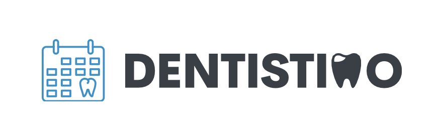

# Purpose  
●  **Scrum Master:** Juan García Díaz

●  **Scrum Developers:** 
- Carlotta Hillger 
- Albin Karlsson 
- Felix Valkama
- Adrian Niklasson
- Liam Jason Axelrod
- Erik Lindmaa
- Qianyuan Wang.

●  **Relevant Links**:
- Trello: https://trello.com/b/3B3muVMz/distributed-systems

●  **Source code and repositories:**
- Main Repository (documentation): https://git.chalmers.se/courses/dit355/dit356-2022/t-6/t6-project
- User Client (developed by Juan and Carlotta): https://git.chalmers.se/courses/dit355/dit356-2022/t-6/user-client
- Dentist client (developed by Liam and Adrian): https://git.chalmers.se/courses/dit355/dit356-2022/t-6/dentist-client
- Booking Management(developed by Erik and Albin): https://git.chalmers.se/courses/dit355/dit356-2022/t-6/booking-management
- User Authentication(developed by felix and wang): https://git.chalmers.se/courses/dit355/dit356-2022/t-6/user-authentication 
# Software  Requirement  Specification  (SRS):  

-   Create a solution that allows citizens of Gothenburg to book dentist appointments
    
-   GUI where users can find available times in user specified time windows,
    
-   Distributed systems combining architectural styles:
    
	-   pipeline
    
	-   publish
    
	-   subscribe
    
	-   layered
    
-   Keep track of availability of free time slots for a number of dentists, user must be able to see this
    
-   User can book appointments and receive confirmation or rejection through system

-   Available for all residents of Gothenburg
    
-   A middleware based on the MQTT protocol must be used.
    
-   Distributed communication must take place.
    
-   Components communicating via middleware have no knowledge about the physical location of other components, and don’t depend on other components residing at a specific physical location. (Distribution Transparency).
    
-   All components must be capable of appropriately handling standard failures, such as wrongly formatted data inputs or out of bounds inputs for the defined interfaces.
    
-   The system's resource-handling shall be mindful.
    
-   GUI must Contain a map-view over Gothenburg that can be navigated.
    
-   GUI must visualize the supply/available slots for appointments
    
-   GUI must allow user requests and delegate incoming user requests.
    
-   GUI must react to responses with appropriate messaging to the user.
    
-   GUI must react to simultaneous bookings by making changes in availability visible to the user.
    
-   The system shall be implemented with 4 distributed components.
    
-   The Distributed System should execute using a collection of nodes, so that each process is mapped onto a node. Nodes can be either separate hardware nodes, or separate operating system processes.
    
-   A broker (centralized P/S component) must be set up and components for the emulation of requests as well as their visualization shall be developed to form the distributed system.
    
-   Use the Message Queue Telemetry Transport (MQTT) protocol as a common broker for most inter-component communication

-   Appointments are each 30 minutes long
    
-   Starting every half or full hour, requiring one dentist.
    
-   A dentist has a lunch break of one hour a day,
    
-   and one Swedish Fika break of 30 minutes.
    
-   Booking requests and responses are to be handled through MQTT.# Software  Architecture  Document  (SAD):  
## Publish and subscribe style  
Given the size of messages, the system will implement a publish and subscribe architecture as a means of communication between components. In order to achieve this, our team will make use of the Message Queuing Telemetry Transport, also known as "MQTT". 

    
## Pipeline style  
In order to safeguard  the application from users accidentally/purposely making identical booking requests, the system will implement the pipeline style between the User Client component and the Time Booking component.  

## Layered style  
### The layered style has been implemented in the system to perform a separation of concerns: 
- Frontend: User / Dentist Clients
- Backend: User authentication / Booking management
- Database: MongoDB

## Conceptual design and techonologies used to implement the different functionalities
The following diagram depicts the conceptual design of the system, showcasing a clear separation of functionalities within the components.

### In order to implement the aforementioned functionalities, we will make use of the following frameworks and resources: 
●  UI User client:  Vue.js 2, Vue-Mqtt  
●  UI Dentist client:  Vue.js 2, Vue-Mqtt  
●  User authentication management:  Auth0 / Firebase,  Express, Node.js, Mqtt  
●  Time booking management:  Express, Node.js, Mqtt  
●  Dentists office location map:  Express, Node.js, Mqtt,  Leaflet.js / Google maps API /  
openlayers

### Example use Case:

## Architecture decisions and tactics
### ASRs:
- **Availability**: Given the fact that the system shall provide dentist  appointment bookings for all citizens  
of Gothenburg. 
- **Simplicity**:  Given the fact that the system will serve a single purpose, simplicity becomes  
important. This is also reflected in the architectural styles that have been chosen.  
- **Performance**:  Given that this system will be used yearly by more than half a million users, it shall be able to handle thousands of concurrent users. This can be achieved using a "publish and subscribe" architecture as it provides light-weight messaging.
### Design decisions regarding components:
We have chosen to implement four different components to create a modular and well structured system: 
●  UI (GUI) User client  
●  UI Dentist client  
●  User authentication management  
●  Time booking management  

### Design decisions regarding technologies:
**Vue** was chosen for various reasons: Vue can help create **code bases that are maintainable and testable**; Vue allows splitting a web page into reusable components and promotes separation of concern. Using Vue's command line tools makes it very easy to quickly initialize a project. 
> The team has decided to use Vue 2 instead of Vue 3 because of unclear MQTT compatibility with Vue 3. 

**Nodejs** was chosen due to the fact that the developer team has experience with it. Choosing familiar technology has  
the benefit of allowing reallocation of resources that would otherwise have been used for learning.
# Program  Management  Report  (PMR):  
## Project management methodology
Considering  the  valuable  work  we  are  conducting  in  the  parallel  course:  DIT348  Software  
Development  Methodologies,  We  have  decided  to  make  use  of  Scrum,  with  applied  user  
story practice and incremental delivery. As defined by the following SPEM diagram: 

The  process  works  in  the  following  manner:  the  team  will  commence  with  the  product  
backlog(The  Project  assignment  brief)  given  to  us  by  the  product  owner(Examiner  +  TA),  
from  the  backlog  the  team  will  create  user  stories  with  acceptance  criteria,  which  will  
become  the  user  story  backlog.  With  the  user  story  backlog,  our  team  will  plan  
increments,  in  which  the  user  stories  will  be  implemented,  after  every  increment,  the  
team  will  conduct  a  review  and  retrospective,  as  well  as  deploying  any  accepted  
changes.

## Management decisions and Products of the first milestone
- Juan was elected scrum master
- Contract was drafted
- Team members created the SRS document.
- Team members created Diagrams to depict our design for the product based on the specifications
## Management decisions and Products of the second milestone
- Team completed User stories backlog
- Scrum master divided components into smaller teams: 
	- User Client: Juan and Carlotta
	- Dentist client: Liam and Adrian
	- Booking Management: Erik and Albin
	- User Authentication: Felix and Wang
- Team pushed initial versions of readme files for every component
- Team decided on frameworks and libraries: 
	- Vue for both clients
	- MQTT for all communication
	- AUTH0 for user management
- Team created initial commits for every component:
	- [User Client](https://git.chalmers.se/courses/dit355/dit356-2022/t-6/user-client/-/commit/5791715cebf3b6fbfbd3f80be9726fdd95647170)
	- [Dentist client](https://git.chalmers.se/courses/dit355/dit356-2022/t-6/dentist-client/-/commit/f0bb97e27e3e5fdc03bbce0759633305ab86ab8c)
	- [Booking Management](https://git.chalmers.se/courses/dit355/dit356-2022/t-6/booking-management/-/commit/bbb3f1bccb2fe54851668389709ba218d2fcb29d)
	- [User Authentication](https://git.chalmers.se/courses/dit355/dit356-2022/t-6/user-authentication/-/commit/4bca4f0d8ef898e377e284073e10e15e5c1905e9)
- Milestones and issues were created for the initial user stories backlog
	- [User Client](https://git.chalmers.se/courses/dit355/dit356-2022/t-6/user-client/-/issues)
	- [Dentist client](https://git.chalmers.se/courses/dit355/dit356-2022/t-6/dentist-client/-/issues)
	- [Booking Management](https://git.chalmers.se/courses/dit355/dit356-2022/t-6/booking-management/-/issues)
	- [User Authentication](https://git.chalmers.se/courses/dit355/dit356-2022/t-6/user-authentication/-/issues)
## Management decisions of the third milestone