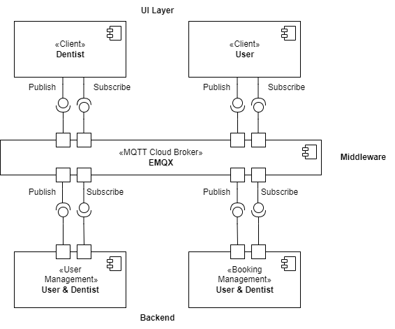
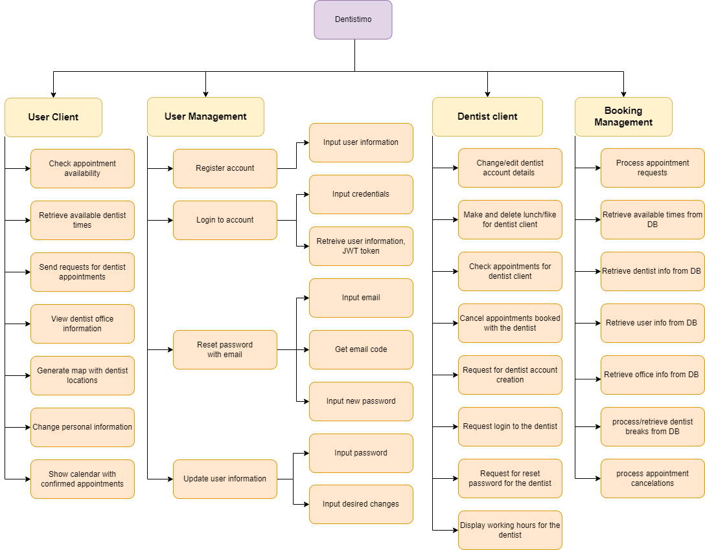
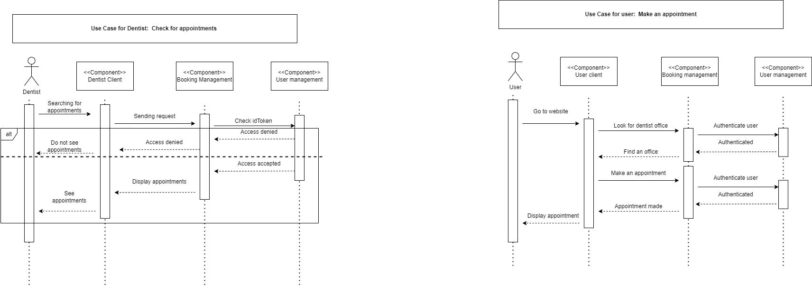

  

  

  

# Purpose

  

  

● **Scrum Master:** Juan García Díaz

  

  

  

● **Scrum Developers:**

  

  

- Carlotta Hillger

  

  

- Albin Karlsson

  

  

- Felix Valkama

  

  

- Adrian Niklasson

  

  

- Liam Jason Axelrod

  

  

- Erik Lindmaa

  

  

- Qianyuan Wang.

  

  

  

● **Relevant Links**:

  

  

- Trello: https://trello.com/b/3B3muVMz/distributed-systems

  

  

  

● **Source code and repositories:**

  

  

- Main Repository (documentation): https://git.chalmers.se/courses/dit355/dit356-2022/t-6/t6-project

  

  

- User Client (developed by Juan and Carlotta): https://git.chalmers.se/courses/dit355/dit356-2022/t-6/user-client

  

  

- Dentist client (developed by Liam and Adrian): https://git.chalmers.se/courses/dit355/dit356-2022/t-6/dentist-client

  

  

- Booking Management(developed by Erik and Albin): https://git.chalmers.se/courses/dit355/dit356-2022/t-6/booking-management

  

  

- User Authentication(developed by Felix and Wang): https://git.chalmers.se/courses/dit355/dit356-2022/t-6/user-authentication

  

# Contributions per member
## Juan García Díaz

### Team Management:

As the scrum master for the whole duration of the project, I conducted the following management work:

-   Design of the agile work methodology used throughout the project, as well as all improvements to it.
    
-   All team management retrospective writing, as well as proofreading of the retrospective work, and the entirety of retrospective 3 and 4.
    
-   Organization of meetings, conducted frequently with Albin’s help.
    
-   Division of work, including the separation into component teams, delegating tasks, weekly check ups on team members and re-assignation of members to tasks based on work capabilities.
    
-   Trello board creation and management, including the supervision of its correct use, guidelines for the team and creation of group assignments.
    

  

### Repository Work:

-   Entire team repository writing, including the update of diagrams and PMR sections.
    
-   User client repository writing alongside Carlotta, including images and diagrams.
    

### Coding:

I developed the entire frontend for the users with my groupmate Carlotta, although i have commits in all issues, my focus on development can be seen in the following areas:

-   [Initial working template](https://git.chalmers.se/courses/dit355/dit356-2022/t-6/user-client/-/commit/5791715cebf3b6fbfbd3f80be9726fdd95647170)
    
-   [CI](https://git.chalmers.se/courses/dit355/dit356-2022/t-6/user-client/-/commit/2f5a00a2e1c17f8877909f1ac41439b731ced6aa)
    
-   [Search appointment page](https://git.chalmers.se/courses/dit355/dit356-2022/t-6/user-client/-/merge_requests/2)
    
-   [Dentist appointment page](https://git.chalmers.se/courses/dit355/dit356-2022/t-6/user-client/-/merge_requests/7)
    
-   [Home page](https://git.chalmers.se/courses/dit355/dit356-2022/t-6/user-client/-/merge_requests/3)
    

### Help to other teams: 
during the beginning of the project, I helped the dentist client team set up the template for a vue project and provided them with the documentation of MQTT, Carlotta and I took over the task of developing the login and signup frontend, even though they were initially assigned to the user management team.

## Carlotta

### Repository work:

I worked with Juan on the user client repository, including the creation of issues with user stories and acceptance criteria, the readme file as well as merge request creations and reviews.

### Coding:

I developed the component user client together with Juan, where my development efforts were focused on:

-   [Establishing the MQTT connection](https://git.chalmers.se/courses/dit355/dit356-2022/t-6/user-client/-/commit/17321767358244f1a0355d5e6a6ca6dbd2964a48)
    
-   [The Calendar page where a user can see all their appointments](https://git.chalmers.se/courses/dit355/dit356-2022/t-6/user-client/-/merge_requests/1)
    
-   [The dentist appointment page where the user can make an appointment](https://git.chalmers.se/courses/dit355/dit356-2022/t-6/user-client/-/merge_requests/7)
    
-   [The sign in, register and forgot password page](https://git.chalmers.se/courses/dit355/dit356-2022/t-6/user-client/-/merge_requests/4)
    

### Help to other teams:

I also assisted the team working on the dentist client to establish the MQTT connection, sending and receiving messages as well as some CSS styling and layout issues. Apart from that I also worked closely together with the user management and booking management team to ensure the compatibility of the messages between the components.

## Erik:

### Repository work:

Worked on the booking management component by creating issues on Gitlab, adding them to Trello, created visual diagrams showing the conceptual idea of the pipe and filter architecture, created a sequence diagram, wrote the readme of the component and wrote in some of the retrospectives, decided on the topics and messages used for the publisher and subscriber. I did the above mentioned tasks with Albin.

  

### Coding:

I worked on the backend with Albin. Together we created the Booking management component where my focus was set on the user clients backend:

  

-   Setting up the online [MQTT broker](https://git.chalmers.se/courses/dit355/dit356-2022/t-6/booking-management/-/commit/4b3f2fff91ccb7ebc795f918ba127eeb24170742), the [mongoDB database](https://git.chalmers.se/courses/dit355/dit356-2022/t-6/booking-management/-/issues/6), and the [CI pipeline](https://git.chalmers.se/courses/dit355/dit356-2022/t-6/booking-management/-/commit/713350c9251967530791ed59dfe38f2e45bfb7b4) for the booking management component.
    
-   [Functionality for sending appointments to the user.](https://git.chalmers.se/courses/dit355/dit356-2022/t-6/booking-management/-/issues/16)
    
-   [Functionality for sending appointments and breaks to the dentist.](https://git.chalmers.se/courses/dit355/dit356-2022/t-6/booking-management/-/issues/12)
    
-   [Deleting appointments as a dentist.](https://git.chalmers.se/courses/dit355/dit356-2022/t-6/booking-management/-/issues/2)
    
-   [Functionality for creating and deleting lunch and fika breaks as a dentist.](https://git.chalmers.se/courses/dit355/dit356-2022/t-6/booking-management/-/issues/15)
    
-   [Set up the load balancer (circuit breaker) for the booking management component.](https://git.chalmers.se/courses/dit355/dit356-2022/t-6/booking-management/-/issues/13)
    
-   [Adding dentist offices to the database.](https://git.chalmers.se/courses/dit355/dit356-2022/t-6/booking-management/-/commit/feac50a0b08a5200b2ee2a4cfdc4a10b05680e84)
    
-   [Added office and booking db schemas](https://git.chalmers.se/courses/dit355/dit356-2022/t-6/booking-management/-/commit/360b0072116fb1e8fe0e900307bcd9da32479df0)
    

  

### Help to other teams:

Have helped the dentist client component team with programming tasks and have generally been available to assist other teams and team members as much as possible. Have contributed with ideas and solutions to issues regarding the project.

  

## Albin

### Repository work:

Erik and I worked on the booking management component. This included the following: creating issues, adding all tasks to trello, creating a diagram representing the PipeFilter architecture style in the component, a sequence diagram, updating readme, deciding on the topics and messages used for the publisher and subscriber, and contributing to the retrospectives.

### Coding:

I worked on the backend with Erik. Together we created the Booking management component where my focus was set on the user clients backend using the PipeFilter architecture style:

-   [Making appointments](https://git.chalmers.se/courses/dit355/dit356-2022/t-6/booking-management/-/commit/101700cfe07cb3ff093dbbf6a3a74fde8082f67b)
    
-   [Fetching available appointments for a specific office and day](https://git.chalmers.se/courses/dit355/dit356-2022/t-6/booking-management/-/issues/1)
    
-   [Fetching offices for the map (leaflet)](https://git.chalmers.se/courses/dit355/dit356-2022/t-6/booking-management/-/issues/19)
    
-   [Allow the user to filter (time and date) to see which offices are available](https://git.chalmers.se/courses/dit355/dit356-2022/t-6/booking-management/-/commit/37d8d6697461226e7e0597361dfa4eebde16d399)
    

I also worked on other tasks such as:

-   [Setting up the PipeFilter template](https://git.chalmers.se/courses/dit355/dit356-2022/t-6/booking-management/-/commit/bbb3f1bccb2fe54851668389709ba218d2fcb29d)
    
-   [Setting the topics and messages for pub and sub](https://docs.google.com/document/d/14qWYwRzbtLCp9yZa-kP_lOYDoCcOPXS8_CPan6RdAk4/edit)
    
-   [Adding dentists to a specific office](https://git.chalmers.se/courses/dit355/dit356-2022/t-6/booking-management/-/commit/b0b4346e829595a02c3b7533d9dafd2949bc2bcf)
    
-   [Worked on database Schemas](https://git.chalmers.se/courses/dit355/dit356-2022/t-6/booking-management/-/commit/360b0072116fb1e8fe0e900307bcd9da32479df0)
    

### Help to other teams:

I have been available to assist any team/component that has requested a second opinion or some code help. I think it is fair to say that I have assisted all groups to some extent. I also took on the responsibility to book team group meetings.  

## Liam

### Repository work:

I always assured that the trello board reflected the work I was doing throughout the project. I ensured that they reflected what milestone I was working on and a link to show one issue specifically I was working on. with Adrian we created the first draft of the readme and we worked on the final draft of the readme

### Coding:

I worked on the creation and implementation of login, register, user profile, password reset pages and assisted in the completion of homepage, appointments. With the homepage I assisted with the logic of the navigation bar and with the appointment page I was in charge of displaying the working hours and making and deleting the fika and lunch breaks. I created a login page to log into your account, a registration page to create your account, a user profile page to change your accounts details, a password reset page to reset your password when you forgot it so you can login. and I worked on all the pages css to ensure their responsiveness when the screen changes size

## Felix

### Repository work:

-   Implement CI pipelines for lint and automatic formatting of the code
    
-   Worked on adding new issues that were not tied to user stories as we ran into issues during development
    
-   Added the aforementioned issues to trello as well
    
-   Wrote the read.me for the user management component with Wang
    

### Coding:

-   User and dentist registration
    
-   Generation of integer IDs for users and dentists
    
-   The circuit breaker for user management
    
-   A method that is used to verify JWT tokens and return their IDs. Used to identify requests to the booking management component
    
-   Functionality for sending MQTT messages to specific clients by generating new topics for response messages
    
-   Combining the functionality to accommodate the two different schemas (user, dentist) in the user management so we could avoid having two register methods for example.
    

### Help to other teams:

-   Helped booking management to implement adding new dentists to the database by putting the dentist ID in the correct dentist office
    
-   Helped booking management implement a method for sending JWT tokens received by the front end to the user management component and extracting the ID the token belongs to from the response
    

## Wang

### Repository work:

-   Add tasks in Trello
    
-   Add all issues, handing issues and merge code on gitlab
    
-   Update the readme file with Felix for our components
    

### Coding:

-   User Login
    
-   Change the password, user can change the password after the user logs in (without forgetting the password)
    
-   Reset password, users can reset their password by receiving a six-digit verification code sent to their email address (in case users forget their password)
    
-   Send a random six-digit verification code to the user's registered email address
    
-   Email bot
    
-   The pages for user registration, login, password change, and password reset for the user client component.
    

### Help to other teams:

-   I created the user registration, login, password change, password reset front-end pages for the user client component.
    

## Adrian

### Repository work:
 I made sure to daily check up on the trello board to have it reflect what I was working on. Together with Liam we made the readme and issues for our component.

### Coding: 
My task for this project was working on the dentist client component together with Liam. On the dentist client component I was assigned and responsible for developing the homepage, navigation bar and together with Liam making of the appointments page. At the end of the project I worked on layout and styling our pages so that they had similar textures, colors and so on. On the appointments page I developed our calendar which is used for fetching an appointment on a specific date specified by the calendar. Furthermore on the appointments page I developed a cancel function which enabled a logged in dentist to cancel a booking made by an user.
  
  

  

# Software Requirement Specification (SRS):

The following list includes all requirements, the format of the was decided by the individual component teams. User story format, acceptance criteria, and implementation can be seen by clicking on the link

User client requirements:

- 1 [As a user I want to be able to login and register so that I can access the systems functionality.](https://git.chalmers.se/courses/dit355/dit356-2022/t-6/user-client/-/issues/6)

- 2 [As a user I want to be able to reset my password so that I can access the systems functionality even if I forgot my password.](https://git.chalmers.se/courses/dit355/dit356-2022/t-6/user-client/-/issues/6)

- 3 [As a user I want to be able to access my personal information so I can see and change it.](https://git.chalmers.se/courses/dit355/dit356-2022/t-6/user-client/-/issues/5)

- 4 [As a user I want to have a page where I can see more information about the dentist so that I can find out whether it is a fit for me.](https://git.chalmers.se/courses/dit355/dit356-2022/t-6/user-client/-/issues/4)

- 5 [As a user I want to be able to make an appointment directly on the website so that I don’t have to make an appointment via the phone.](https://git.chalmers.se/courses/dit355/dit356-2022/t-6/user-client/-/issues/4)

- 6 [As a user I want the system to show me what appointments are available for that dentist so that i can select the one that works best for me.](https://git.chalmers.se/courses/dit355/dit356-2022/t-6/user-client/-/issues/4)

- 7 [As a user I want to have a page with a map showing me the location of the different dentists so that I can choose the one that is working best for me and make an appointment with them.](https://git.chalmers.se/courses/dit355/dit356-2022/t-6/user-client/-/issues/3)

- 8 [As a user I want to be able to filter the dentists based on the day(s) and time(s) I want to make an appointment so that I can find one at a time where I am available.](https://git.chalmers.se/courses/dit355/dit356-2022/t-6/user-client/-/issues/3)

- 9 [As a user I want to be able to have a page to view my past and upcoming appointments so that I don’t miss any appointments and can keep track of when to schedule the next one.](https://git.chalmers.se/courses/dit355/dit356-2022/t-6/user-client/-/issues/2)

- 10 [ As a user I want to be able to cancel appointments that I made in the system so that someone else can use that slot.](https://git.chalmers.se/courses/dit355/dit356-2022/t-6/user-client/-/issues/2)

- 11 [As a user I want to be able to have a home page so that I can access all the features of the system.](https://git.chalmers.se/courses/dit355/dit356-2022/t-6/user-client/-/issues/1)

  

Dentist client requirements:

- 12 [Homepage functionality](https://git.chalmers.se/courses/dit355/dit356-2022/t-6/dentist-client/-/issues/2)

- 13 [Create and display appointments page](https://git.chalmers.se/courses/dit355/dit356-2022/t-6/dentist-client/-/issues/3)

- 14 [Create and display a register and login page](https://git.chalmers.se/courses/dit355/dit356-2022/t-6/dentist-client/-/issues/5)

- 13 [Login page functionality](https://git.chalmers.se/courses/dit355/dit356-2022/t-6/dentist-client/-/issues/18)

- 14 [Create and display user profile page](https://git.chalmers.se/courses/dit355/dit356-2022/t-6/dentist-client/-/issues/7)

- 15 [User profile page functionality](https://git.chalmers.se/courses/dit355/dit356-2022/t-6/dentist-client/-/issues/8)

- 16 [Create and display dentist working hours](https://git.chalmers.se/courses/dit355/dit356-2022/t-6/dentist-client/-/issues/10)

- 17 [Create calendar display for registered appointments](https://git.chalmers.se/courses/dit355/dit356-2022/t-6/dentist-client/-/issues/11)

- 18 [Create notification for cancelled or changed appointments](https://git.chalmers.se/courses/dit355/dit356-2022/t-6/dentist-client/-/issues/12)

- 19 [Information on user client appointments](https://git.chalmers.se/courses/dit355/dit356-2022/t-6/dentist-client/-/issues/13)

- 20 [Create register page layout](https://git.chalmers.se/courses/dit355/dit356-2022/t-6/dentist-client/-/issues/15)

- 21 [Update login page](https://git.chalmers.se/courses/dit355/dit356-2022/t-6/dentist-client/-/issues/16)

- 22 [Functionality for register page](https://git.chalmers.se/courses/dit355/dit356-2022/t-6/dentist-client/-/issues/17)

- 23 [Functionality for dentist profile](https://git.chalmers.se/courses/dit355/dit356-2022/t-6/dentist-client/-/issues/19)

- 24 [User page](https://git.chalmers.se/courses/dit355/dit356-2022/t-6/dentist-client/-/issues/20)

- 25 [User token validation in homepage](https://git.chalmers.se/courses/dit355/dit356-2022/t-6/dentist-client/-/issues/21)

- 26 [Layout and styling](https://git.chalmers.se/courses/dit355/dit356-2022/t-6/dentist-client/-/issues/22)

- 27 [Reset password](https://git.chalmers.se/courses/dit355/dit356-2022/t-6/dentist-client/-/issues/23)

  

Booking management requirements:

- 28 [Available appointments](https://git.chalmers.se/courses/dit355/dit356-2022/t-6/booking-management/-/issues/1)

- 29 [Cancel appointments](https://git.chalmers.se/courses/dit355/dit356-2022/t-6/booking-management/-/issues/2)

- 30 [Max bookings](https://git.chalmers.se/courses/dit355/dit356-2022/t-6/booking-management/-/issues/4)

- 31 [Dentist Breaks](https://git.chalmers.se/courses/dit355/dit356-2022/t-6/booking-management/-/issues/5)

- 32 [Database](https://git.chalmers.se/courses/dit355/dit356-2022/t-6/booking-management/-/issues/6)

- 33 [Recieve booking request](https://git.chalmers.se/courses/dit355/dit356-2022/t-6/booking-management/-/issues/7)

- 34 [Publish dentist offices to users](https://git.chalmers.se/courses/dit355/dit356-2022/t-6/booking-management/-/issues/10)

- 35 [Search for an office](https://git.chalmers.se/courses/dit355/dit356-2022/t-6/booking-management/-/issues/11)

- 36 [See all appointments as a dentist](https://git.chalmers.se/courses/dit355/dit356-2022/t-6/booking-management/-/issues/12)

- 37 [Publish all apointments belonging to user](https://git.chalmers.se/courses/dit355/dit356-2022/t-6/booking-management/-/issues/16)

- 38 [Dentist availability](https://git.chalmers.se/courses/dit355/dit356-2022/t-6/booking-management/-/issues/18)

- 39 [See available offices](https://git.chalmers.se/courses/dit355/dit356-2022/t-6/booking-management/-/issues/19)

- 40 [Load balancing](https://git.chalmers.se/courses/dit355/dit356-2022/t-6/booking-management/-/issues/13)

  

User Management requirements:

- 41 [As a user, I want my information to be securely transmitted because I don’t want anyone to be able to steal it.](https://git.chalmers.se/courses/dit355/dit356-2022/t-6/user-management/-/issues/1)

- 42 [As a user, I want to be able to register an account and log in to the website because I want to be able to book appointments in my name.](https://git.chalmers.se/courses/dit355/dit356-2022/t-6/user-management/-/issues/2)

- 43 [As a user, I want to be able to reset my password because I might forget it.](https://git.chalmers.se/courses/dit355/dit356-2022/t-6/user-management/-/issues/3)

- 43 [As a user, I want bookings to require authentication because I don’t want others to make or cancel appointments in my name.](https://git.chalmers.se/courses/dit355/dit356-2022/t-6/user-management/-/issues/4)

- 44 [As a user, I would like to effectively distinguish whether the operator is a user or non-user of the program, as this will protect the rights of both parties.](https://git.chalmers.se/courses/dit355/dit356-2022/t-6/user-management/-/issues/6)

- 45 [As a user, I would like to have a separate account, as this would guarantee my privacy and independence.](https://git.chalmers.se/courses/dit355/dit356-2022/t-6/user-management/-/issues/7)

- 46 [As a dentist, I would like to have different permissions compared to regular users because I don’t want users to be able to use any of the dentist's exclusive functions.](https://git.chalmers.se/courses/dit355/dit356-2022/t-6/user-management/-/issues/8)

- 47 [Circuit breaker](https://git.chalmers.se/courses/dit355/dit356-2022/t-6/user-management/-/issues/9)

# Software Architecture Document (SAD)

  

## Publish and subscribe style

  

**Why we implemented it**

Given the size of messages, the system implements a publish and subscribe architecture as a means of communication between components.

  

**How we implemented it**

In order to achieve this, our team made use of the Message Queuing Telemetry Transport, also known as "MQTT". To ensure the arrival of the messages the whole system is set up with QOS 2, meaning the clients and servers will ensure the message has been received. All component communication is made through MQTT, and components dynamically subscribe and write to components depending on user interactions to efficiently process and respond to messages. For example, when a user selects a time and day to search for an appointment, the user client sends a message and temporarily subscribes to the response topic until an answer has arrived.

  

**Where we implemented it**

  

  

  

## Pipeline style

  

**Why we implemented it**

In order to safeguard the application from users accidentally/purposely making identical booking requests, the system will implement the pipeline style between the User Client component and the Booking component. Since we have many components interacting with each other we determined that a pipeline architecture style would be appropriate, as it makes for a very modular design.

  

**How we implemented it**

When any message is received in the time booking management component on a defined topic that it is subscribed to, the message will be handled according to what information it contains using functions that are defined as filters. The filter does various tasks when it receives a message. It can change a parameter of a message, compare a parameter of the message to what is in the database and so on. The message then enters its final filter, which becomes the data destination. This is often a publish function that sends back the data to the frontend.

**Where we implemented it**

  

  

  

## Layered style

  

  

### The layered style has been implemented in the system to perform a separation of concerns:

  

  

**Why we implemented it**

  

We implemented layered architecture in order to efficiently divide the work into a simple and clear separation of concerts. A contributing factor to our decision was the reduced dependency because the function of each layer is separate from the other layers. This separation of concerns also made our testing efforts easier to implement in our continuous development cycle.

  

**Where we implemented it**

  

To create a layered architecture, we categorized our components in the following layers:

  

- Frontend: User / Dentist Clients

- Backend: User authentication / Booking management

- Database: MongoDB

  

**How we implemented it**

  

The components execute a clear separation of concerns, depicted in the following functional decomposition diagram:

  

  

  

### In order to implement the aforementioned functionalities, we will make use of the following frameworks and resources:

  

  

● UI User client: Vue.js 2, Vue-Mqtt

  

  

● UI Dentist client: Vue.js 2, Vue-Mqtt

  

  

● User authentication management: Auth0 / Firebase, Express, Node.js, Mqtt

  

  

● Time booking management: Express, Node.js, Mqtt

  

  

● Dentists office location map: Express, Node.js, Mqtt, Leaflet.js / Google maps API / openlayers

  

  

### Example use Case:

  

  

  

## Traceability

The project is made up of 5 repositories within the gitlab group [“T-6”](https://git.chalmers.se/courses/dit355/dit356-2022/t-6). All information regarding the management of the project and the architecture has been collected in the [T6 Project repository](https://git.chalmers.se/courses/dit355/dit356-2022/t-6/t6-project). Aside from the main repository, there is one repository per component, each containing the code product, the relevant issues that make up the product, as well as a readme file detailing the use of the component, the architecture, the authors and other relevant information. In order to add traceability our team created an issue for every user story, these can be found on trello and gitlab. Linked to every user story, we created a branch to implement the code for the component, changes to documentation, the CI and the initial template were directly pushed to main.

  

  

This is an example of how traceability was added, which allows anyone to see where code for a certain functionality was implemented:

  

1. To see the status of a task we can click on the [trello card](https://trello.com/c/zUcDY2HY/76-search-appointment-page) linked to it. In the description we find the following information: the member assigned to the task, in this case Juan, the milestone this task belongs to, in this case milestone 3 and lastly, a [link](https://git.chalmers.se/courses/dit355/dit356-2022/t-6/user-client/-/issues/3) to the relevant issue.

  

2. By clicking the [link](https://git.chalmers.se/courses/dit355/dit356-2022/t-6/user-client/-/issues/3) we can access the gitlab issue detailing what was implemented in this task. In this case we can see the following information. This user page included two user stories and 4 different acceptance criteria, in order to see how this was implemented, you can scroll down and see the connected [merge request](https://git.chalmers.se/courses/dit355/dit356-2022/t-6/user-client/-/merge_requests/2).

  

3. By clicking on the [merge request](https://git.chalmers.se/courses/dit355/dit356-2022/t-6/user-client/-/merge_requests/2). You are taken to a page where you can see relevant information, including a log of all commits, who approved and reviewed the merge request, in this case Carlotta and lastly the state of the CI pipeline, which in this page can be seen as a green tick, indicating its success.

## Architecture decisions and tactics

  

  

### ASRs:

  

- **Availability:** Given the fact that the system shall provide dentist appointment bookings for all citizens of Gothenburg. This was achieved using circuit breakers in both backend components to minimize downtime.

- **Simplicity:** Given the fact that the system will serve a single purpose, simplicity becomes important. This was achieved using APIs(Leaflet and Full-Calendar) to simplify the use cases for the user client.

- **Performance:** Given that this system will be used yearly by more than half a million users, it shall be able to handle thousands of concurrent users. This was achieved using a "publish and subscribe" architecture as it provides light-weight messaging with MQTT.

- **Usability:** Given that the end goal is the release of a product for a large number of users with vastly different levels of technological literacy. This was achieved with extensive rounds of peer testing to ensure the user client was intuitive.

- **Reliability:** Given that the system will be under constant stress of large numbers of concurrent users, this was also achieved using circuit breakers in both backend components.

  

  

### Design decisions regarding components:

  

We have chosen to implement four different components to create a modular and well structured system:

  

● UI User client

  

● UI Dentist client

  

● User authentication management

  

● Time booking managemen

  

### Design decisions regarding technologies:

  

  

**Vue** was chosen for various reasons: Vue can help create **code bases that are maintainable and testable**; Vue allows splitting a web page into reusable components and promotes separation of concern. Using Vue's command line tools makes it very easy to quickly initialize a project.

  

> The team has decided to use Vue 2 instead of Vue 3 because of unclear MQTT compatibility with Vue 3.

  

**Nodejs** was chosen due to the fact that the developer team has experience with it. Choosing familiar technology has the benefit of allowing reallocation of resources that would otherwise have been used for learning.

  

  

# Program Management Report (PMR):

  

  

## Project management methodology

  

  

Considering the valuable work we are conducting in the parallel course: DIT348 Software Development Methodologies, We have decided to make use of Scrum, with applied user story practice and incremental delivery. As defined by the following SPEM diagram:

  

  

  

  

  

The process works in the following manner: the team will commence with the product backlog(The Project assignment brief) given to us by the product owner(Examiner + TA), from the backlog the team will create user stories with acceptance criteria, which will become the user story backlog. With the user story backlog, our team will plan increments, in which the user stories will be implemented, after every increment, the team will conduct a review and retrospective, as well as deploying any accepted changes.

  

  

  

## Management decisions and Products of the first milestone

  

  

- Juan was elected scrum master

  

- Contract was drafted

  

- Team members created the SRS document.

  

- Team members created Diagrams to depict our design for the product based on the specifications

  

  

## Management decisions and Products of the second milestone

  

Scrum master divided components into smaller teams:

  

- User Client: Juan and Carlotta

  

- Dentist client: Liam and Adrian

  

- Booking Management: Erik and Albin

  

- User Authentication: Felix and Wang

  

  

Team management decisions:

  

- Pushed initial versions of readme files for every component

  

- Decided on frameworks and libraries:

  

- Vue for both clients

  

- MQTT for all communication

  

- AUTH0 for user management

  

  

Initial commits for every component:

  

- [User Client](https://git.chalmers.se/courses/dit355/dit356-2022/t-6/user-client/-/commit/5791715cebf3b6fbfbd3f80be9726fdd95647170)

  

- [Dentist client](https://git.chalmers.se/courses/dit355/dit356-2022/t-6/dentist-client/-/commit/f0bb97e27e3e5fdc03bbce0759633305ab86ab8c)

  

- [Booking Management](https://git.chalmers.se/courses/dit355/dit356-2022/t-6/booking-management/-/commit/bbb3f1bccb2fe54851668389709ba218d2fcb29d)

  

- [User Authentication](https://git.chalmers.se/courses/dit355/dit356-2022/t-6/user-authentication/-/commit/4bca4f0d8ef898e377e284073e10e15e5c1905e9)

  

  

Milestones and issues were created for the initial user stories backlog

  

- [User Client](https://git.chalmers.se/courses/dit355/dit356-2022/t-6/user-client/-/issues)

  

- [Dentist client](https://git.chalmers.se/courses/dit355/dit356-2022/t-6/dentist-client/-/issues)

  

- [Booking Management](https://git.chalmers.se/courses/dit355/dit356-2022/t-6/booking-management/-/issues)

  

- [User Authentication](https://git.chalmers.se/courses/dit355/dit356-2022/t-6/user-authentication/-/issues)

  

  

## Management decisions and Products of the third milestone

  

Management decisions:

  

- Auth0 will not be used, user management team will develop it without the external API.

  

- Changes to Auth0 implies that both clients will have to implement user management pages.

  

- Team has moved all communication to an online format due to the holidays.

  

- Team has decided not to work on Christmas Eve, Christmas day, New Years Eve and New years day.

  

- After a long discussion between the booking management and user client teams, we have decided to keep the separation of concerns to comply with the layered architectural style.

  

User client functionalities to:

  

- [Build CI.](https://git.chalmers.se/courses/dit355/dit356-2022/t-6/user-client/-/commit/2f5a00a2e1c17f8877909f1ac41439b731ced6aa)

  

- [MQTT connection.](https://git.chalmers.se/courses/dit355/dit356-2022/t-6/user-client/-/commit/17321767358244f1a0355d5e6a6ca6dbd2964a48)

  

- [Search appointment page frontend.](https://git.chalmers.se/courses/dit355/dit356-2022/t-6/user-client/-/jobs/244415)

  

- [Calendar page frontend.](https://git.chalmers.se/courses/dit355/dit356-2022/t-6/user-client/-/merge_requests/1)

  

Booking management functionalities to:

  

- [Finding appointment.](https://git.chalmers.se/courses/dit355/dit356-2022/t-6/booking-management/-/merge_requests/12/diffs?commit_id=130f0ce8902491a74a19855a96597272ca9598cc)

  

- [Registering breaks for dentists.](https://git.chalmers.se/courses/dit355/dit356-2022/t-6/booking-management/-/merge_requests/11/diffs?commit_id=7f250a947e5028918605be1f5d66ac2371e417ff)

  

- [Registration of dentist offices](https://git.chalmers.se/courses/dit355/dit356-2022/t-6/booking-management/-/merge_requests/8/diffs?commit_id=c8a76cccf34bc5f47fb75b807474eebb0c5dfc7f)

  

User management functionalities to:

  

- [Login.](https://git.chalmers.se/courses/dit355/dit356-2022/t-6/user-authentication/-/commit/013c6113e529488b4b71caa236df2664f20525db)

  

- [Registering.](https://git.chalmers.se/courses/dit355/dit356-2022/t-6/user-authentication/-/commit/9214d8c4b0eb551671146b6f7a5281dd9e13af0e)

  

Dentist Client functionalities to:

  

- [Home page and navigation bar.](https://git.chalmers.se/courses/dit355/dit356-2022/t-6/dentist-client/-/commit/6adba1d8a63851a70d98b7d5a821aeebaf5a5e45)

  

- [Layout for user profile.](https://git.chalmers.se/courses/dit355/dit356-2022/t-6/dentist-client/-/commit/ee19aa6b365f36deda491e6eb0d7db7fcd271440)

  

- [Login and registering.](https://git.chalmers.se/courses/dit355/dit356-2022/t-6/dentist-client/-/commit/b11dd7ad6296fc5eef758432c4fbf5834e4d2e39)

  

- [Build CI:](https://git.chalmers.se/courses/dit355/dit356-2022/t-6/dentist-client/-/commit/1a367526c3c0332a4bdc2d4b6f44b0785841165d)

  

## Management decisions and Products of the fourth milestone

Management decisions and documentation:

  

- The team was given the 6th of january as the deadline to complete their user stories

- The team was given the 7th as the deadline to complete their team's repository ReadMe

- The scrum master was assigned to the writing of retrospective 4

- The scrum master was assigned to the writing of the main repository

- The team decided on the 8th as the day to rehearse the presentation

  

User client work products:

  

- [Login, registration and forgot password pages](https://git.chalmers.se/courses/dit355/dit356-2022/t-6/user-client/-/merge_requests/4)

- [Dentist page](https://git.chalmers.se/courses/dit355/dit356-2022/t-6/user-client/-/merge_requests/7)

- [Profile page](https://git.chalmers.se/courses/dit355/dit356-2022/t-6/user-client/-/merge_requests/6)

  

Booking management work products:

  

- [Search offices, dynamically using a map](https://git.chalmers.se/courses/dit355/dit356-2022/t-6/booking-management/-/issues/19)

- [Show available appointments after user filtering (date and time)](https://git.chalmers.se/courses/dit355/dit356-2022/t-6/booking-management/-/issues/1)

- [Updated user book appointment functionality](https://git.chalmers.se/courses/dit355/dit356-2022/t-6/booking-management/-/issues/3)

- [Functionality for registering lunch and fika breaks for dentists.](https://git.chalmers.se/courses/dit355/dit356-2022/t-6/booking-management/-/issues/15)

- [Load balancing by implementing an opossum circuit breaker.](https://git.chalmers.se/courses/dit355/dit356-2022/t-6/booking-management/-/issues/13)

  

User management work products:

  

- [Circuit breaker](https://git.chalmers.se/courses/dit355/dit356-2022/t-6/user-management/-/issues/9)

- [Authentication](https://git.chalmers.se/courses/dit355/dit356-2022/t-6/user-management/-/issues/15)

- [Update user/dentist](https://git.chalmers.se/courses/dit355/dit356-2022/t-6/user-management/-/issues/11)

- [Reset password](https://git.chalmers.se/courses/dit355/dit356-2022/t-6/user-authentication/-/issues/3)

- [Dentist and user have different schema](https://git.chalmers.se/courses/dit355/dit356-2022/t-6/user-management/-/issues/8)

  

Dentist Client work products:

  

- [Correct payload for login and registration](https://git.chalmers.se/courses/dit355/dit356-2022/t-6/dentist-client/-/merge_requests/21/commits)

- [Appointment page](https://git.chalmers.se/courses/dit355/dit356-2022/t-6/dentist-client/-/merge_requests/21)

- [Completed backend connection to all pages](https://git.chalmers.se/courses/dit355/dit356-2022/t-6/dentist-client/-/merge_requests/21/commits)

- [Fixed layout issues](https://git.chalmers.se/courses/dit355/dit356-2022/t-6/dentist-client/-/merge_requests/25/commits)

- [added password reset page](https://git.chalmers.se/courses/dit355/dit356-2022/t-6/dentist-client/-/commit/5b8a765a016375167248cbe268f6810ecb229c48)
